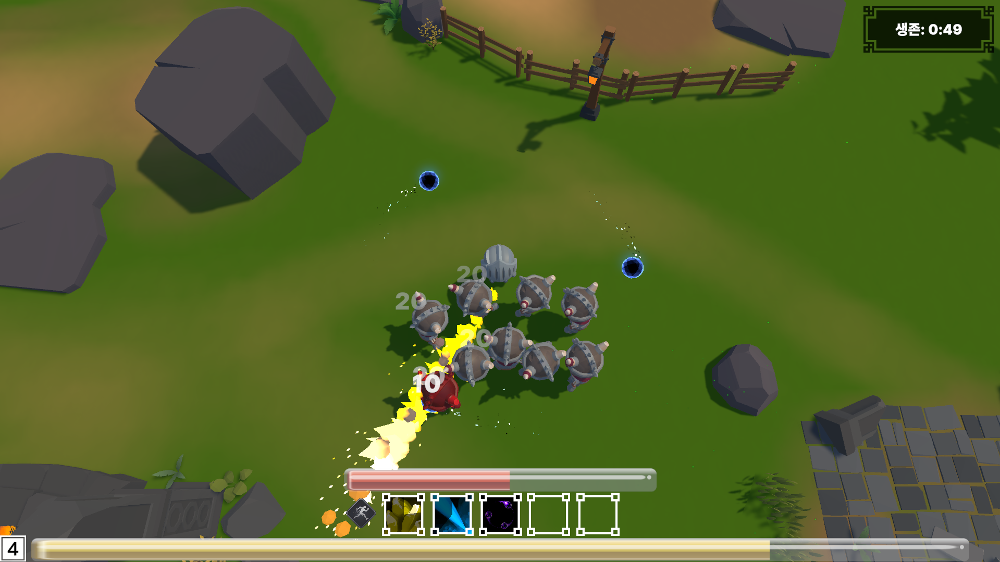

# 코어 서바이벌 (Core Survival)

**3D 탑다운 아레나 서바이벌 — 적 90마리가 동시에 몰려와도 프레임이 유지되는 오브젝트 풀링 데모**

사방에서 몰려오는 적을 자동 공격으로 처치하며 버티는 게임입니다.
플레이어가 조작하는 것은 이동과 대시 회피뿐이고, 레벨업마다 뜨는 세 개의 선택지가 그 판의 빌드를 만듭니다.

| | |
|---|---|
| **엔진 / 언어** | Unity 2022.3.62f3 / C# |
| **개발 기간 / 인원** | 2026.08.24 ~ 09.11 (약 3주) / 1인 |
| **플랫폼** | PC (Windows) |
| **성격** | 부트캠프 미니 프로젝트 겸 포트폴리오 |

**▶ [시연 영상](링크)** · **📄 [기술 문서](링크)** · **⬇ [빌드 다운로드](링크)**

<!-- 이미지 넣을 자리: docs/ 폴더를 만들고 플레이 화면 캡처를 넣은 뒤 아래 주석을 푼다

-->

---

## 한눈에 보기

| | 수치 |
|---|---|
| 동시 등장 적 | **90마리** |
| 스킬 | **5종** (자동 발사) |
| 레벨업 선택지 | **18개** (습득 5 + 데미지 강화 5 + 쿨타임 강화 5 + 스탯 3) |
| 웨이브 | **20단계** (약 6분 40초) |
| 프레임당 GC 할당 | **320 B** (Development Build, 적 90마리 고정 조건) |
| 스크립트 | 52개 |

---

## 이 프로젝트에서 볼 것 세 가지

### 1. 오브젝트 풀링 3종 — 같은 패턴을 세 번 복사하지 않았습니다

대상의 성질이 달라 자료구조와 정책이 각각 달라졌습니다.

| | `EnemyPooling` | `SkillEffectPooling` | `DamageTextPooling` |
|---|---|---|---|
| 자료구조 | `Queue` + 활성 `List` | `Dictionary<SkillID, Queue>` | `Queue` + 활성 `Queue` |
| 상태 수 | **셋** (활성 / 시체 / 큐) | 둘 | 둘 |
| 반환 | **2단계** (사망 연출 0.9초) | 1단계 | 1단계 + **강제 회수** |
| 큐가 비면 | 새로 만든다 | 새로 만든다 | **가장 오래된 것을 뺏는다** |

데미지 숫자 풀만 고갈 정책이 반대입니다. 프리웜 개수가 곧 화면 표시 상한이 되어
런타임 `Instantiate`가 구조적으로 0입니다. 적이 안 나오면 게임이 깨지지만
숫자 하나가 일찍 사라지는 것은 알아차리기 힘들기 때문입니다.

### 2. 확장에 열려 있다는 것을 고친 파일 수로 증명했습니다

주장하는 대신 실제로 세 번 확장하고 손댄 곳을 셌습니다.

| 확장 | 고친 곳 | 안 고친 곳 |
|---|---|---|
| 스킬 2종 추가 | `SkillID` enum, `CreateSkill`의 `switch` — **2곳** | 풀, HUD, 선택지 패널 |
| 스킬 강화 선택지 신설 | 새 선택지 클래스 1개 + 에셋 | 선택지 패널 **0줄** |
| 쿨타임 강화 추가 | 기존 클래스에 필드 1개 | 선택지 패널·버튼 **0줄** |

레벨업 선택지는 6개에서 18개까지 늘었지만 패널에는 선택지 종류 분기가 없습니다.

### 3. 측정하고 결과를 그대로 적었습니다

풀링을 켜고 끄며 같은 빌드에서 A/B로 쟀습니다.

| | 풀링 ON | 풀링 OFF |
|---|---|---|
| 프레임 타임 Median | 16.67 ms | 16.67 ms |
| 적이 스폰되는 프레임의 GC 할당 | **320 B** | **1.8 KB** |
| `Instantiate` 마커 | **없음** | 나타남 |

프레임 타임 차이는 관측되지 않았습니다. 실제 작업이 7~8 ms인데 예산이 16.6 ms라
애초에 여유가 있었기 때문입니다
차이는 할당에서만 나타났고, 초당 할당률로 환산하면 19 KB/s 대 108 KB/s입니다.

측정의 실제 성과는 A/B가 아니라 그 과정에서 찾은 것이었습니다.
**프레임당 GC 할당의 90%가 디버그 로그였습니다** (3.1 KB → 320 B).
스킬 이펙트의 로그 플래그 기본값이 켜져 있어 빌드에서도 매 타격마다
문자열 보간과 스택 트레이스 캡처가 돌고 있었습니다.

> 판단의 근거와 나머지 시스템은 [기술 문서](링크)에 있습니다.

---

## 코드에서 보기

| 보고 싶은 것 | 파일 |
|---|---|
| 오브젝트 풀링 3종 | `Assets/Scripts/Runtime/Pool/` — `EnemyPooling` · `SkillEffectPooling` · `DamageTextPooling` |
| 스킬 로직과 이펙트 분리 | `Runtime/Skills/SkillsBase.cs` · `SkillEffectBase.cs` |
| ScriptableObject 데이터 설계 | `Runtime/Skills/SkillDataSO.cs` · `Runtime/Skills/LevelUpOptions/LevelUpOptionSO.cs` |
| 게임 상태 머신 | `Runtime/GameManager.cs` |
| UI 패널 다형성 | `Runtime/UI/MenuPanelBase.cs` |
| 데미지 인터페이스 | `Runtime/Interface/IDamageable.cs` |
| 적 AI (추적 · 겹침 방지 · 지면 스냅 · 공격 판정) | `Runtime/Enemy/TempEnemy.cs` |
| 웨이브 스폰 | `Runtime/Pool/EnemySpawner.cs` |

```
Assets/Scripts/Runtime/
├── GameManager.cs          상태 머신 · timeScale · 처치 수 · 생존 시간
├── Pool/                   풀링 3종 + 웨이브 스포너        (5)
├── Skills/                 스킬 로직 5종 · 이펙트 5종 · SO  (15)
│   └── LevelUpOptions/     레벨업 선택지 SO 상속 구조       (5)
├── UI/                     패널 · HUD · 사운드              (12)
├── Player/                 이동 · 피격 · 경험치 · 적 스캐너 (5)
├── Enemy/                  TempEnemy                        (1)
├── Scenes/                 씬 전환 · 로딩                   (6)
├── Camera/                 탑다운 카메라                    (1)
└── Interface/              IDamageable                      (1)
```

---

## 저장소 상태 — 클론해도 실행되지 않습니다

**유료/외부 에셋 5종을 저장소에서 제외**했습니다.
코드는 전부 올라가 있지만, 클론하면 모델·이펙트·아이콘·맵이 비어 있어 게임이 동작하지 않습니다.

| 제외된 에셋 | 없으면 |
|---|---|
| `KayKit` | 적 모델과 애니메이션, 공격 Animation Event |
| `Polygon Arsenal` | 스킬 이펙트 5종 |
| `Skill_Icon_Pack` | 스킬 아이콘 (선택지와 HUD가 빈칸) |
| `LowPolyFantasyArena2` | 아레나 맵 |
| `GUI Interface Kit Free` | UI 스킨 |

**실제로 플레이해보시려면 [빌드 다운로드](링크)를 받아 `Core_Survival.exe`를 실행하시면 됩니다.**
저장소는 코드를 읽는 용도로 봐주시기 바랍니다.

---

## 조작

| 키 | 동작 |
|---|---|
| **W A S D** / 방향키 | 이동 |
| **Space** | 대시 (쿨타임 1초) |
| **ESC** | 일시정지 — 플레이어 스탯과 스킬별 강화 현황 |

공격은 자동입니다. 시간이 지날수록 적이 더 많이 더 강하게 몰려옵니다.
